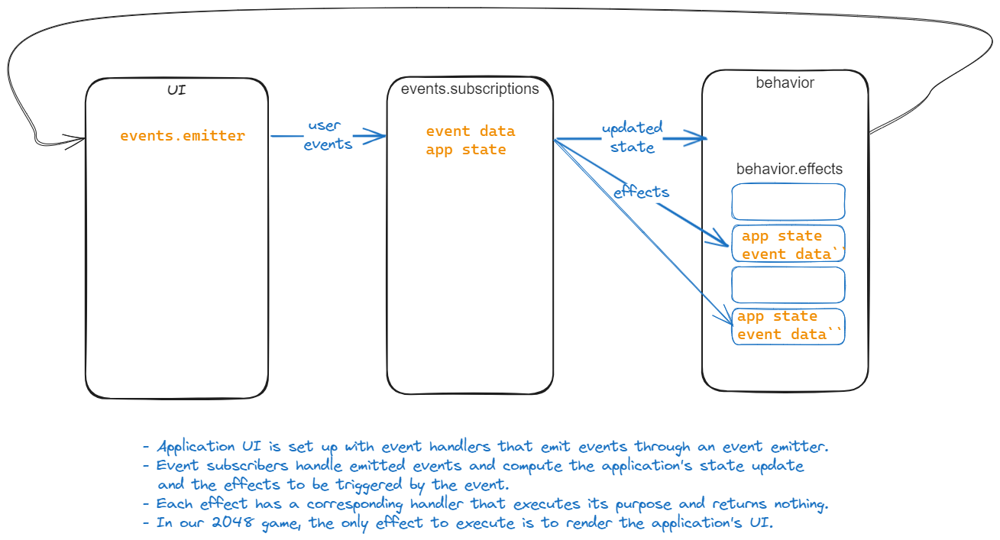

# What
Variations, musings, and learning good practices through the 2048 game

# Why
Writing down for myself and others some good practices for software development. Rather than abstractly list principles, everything will be derived from the specification and implementation of an actual application. Not too easy, not too hard, not too ugly, not too pretty. 

- We are not necessarily looking into making a top-notch app but rather identifying common issues in software development, and common solutions, and the rationale behind them.
- We are not looking either into the perfect technical writing, at least in a first iteration, but in the validity of the recommendations first and foremost (substance over presentation).

Let's see how far we can go.

# HL requirement for this branch

# Non-functional requirements and constraints
- application is distributed on the web through a public web page without any login
- game experience must be nice and enticing enough to generate spontaneous recognition and word-of-mouth

# Functional requirements for this branch
- Rules of the original 2048 game: https://www.baeldung.com/cs/2048-algorithm
- given a game in progress, where a move to the right is possible, and the user does move to the right, the board switches to the right and is redrawn according to the game rules

CHANGED TO:
- Given:
  - a game in progress
- When the users swipes right
- Then: 
  - the game board is updated as per the rules of the game
  - the current score is updated as per the rules of the game
  - the best score is updated as per the rules of the game
  
  ## ADR:
  - Note that we don't include here more statement on the change in game status. The swipe right may lead to the user winning or loosing but the relevant requirement will be addressed later. This is of course arbitrary. The decision criteria is to keep the requirement small enough that ONE person can get it done in an arbitrary short amount of time.
  - Pros
    - decreases the complexity of the tests for the person writing the tests. Tests have to be simple enough that they don't have to be themself tested! Complexity is managed by keeping the unit of requirement under test small (requirement complexity), but also algorithmically simple (test implementation complexity).
  - Cons
    - Some requirements may depend on the requirement under test and thus can only be performed after tests are passing. In the case of a team of several developers, this reduces options to have several developers work on parallel on different requirements. 

  - Note that we focus on requirement linked to the user. We try to avoid testing implementation details. Implementation details change with the implementation, while the requirements stay identical. We strive to only have to rewrite tests as a result of change in requirements.
    - the function that returns the game status could be considered an implementation detail
    - the function `collapse_to_the_right` could be considered an implementation detail. It implements a game rule, which is a requirement, but the fact that it is a pure function (vs. for instance a class method), its name, signature etc. are implementation details.
    - Pros
      - the aforementioned. More value for a given engineering effort
    - Cons
      - it may not always be possible to abstract away implementation details. Those implementation details that are reified into tests should thus become requirements of their own.
      - for instance, `get_seeded_random_generator` is an implementation detail. However, an application that does not have this function will fail the test when it could perfectly be correctly implemented! , The function has thus become a *de facto* technical requirement. We try to minimize those. Also we have assumed but not tested that the function was actually used to generate the initial board. We tested that we had two non-empty cells when creating a new game but not the frequency at which the values of those cells appear. In other words, we did [gray box testing](https://en.wikipedia.org/wiki/Gray-box_testing) here.

# Approach
- Implementation
  - How do we know that the game is in progress????
    - we could require the application to export a function that returns the game status
      - but how do we test that function then? If we are able to create test conditions for various values of that function then we don't need the function anymore. We can directly create those conditions for testing that a game is in progress
    - so we don't. We are going to assume that when a user starts a new game (e.g., clicks on the new game button), the game is in progress. This assumption is actually a requirement in disguise.
  - We do require the application to export a function that collapses rows (or columns) of cells. Here we focus on `collapse_to_the_right` which takes a row from the board, and returns the updated row that should replace the old one. Once again, we are going to test that function first.

- Design:
  - `collapse_to_the_right` ([a,b,c,d]) -> [r,s,t,u] where a letter stands for either 0 or an integer power of 2
  - [r,s,t,u] should be the result of collapsing the row according to the game rules, as [taken from wikipedia](https://en.wikipedia.org/wiki/2048_(video_game)).
  - Similarly, `compute_score_after_collapse` ([a,b,c,d]) -> points to add to the current score.

- Game rules for collapsing
> Tiles slide as far as possible in the chosen direction until they are stopped by either another tile or the edge of the grid. If two tiles of the same number collide while moving, they will merge into a tile with the total value of the two tiles that collided.[7][8] The resulting tile cannot merge with another tile again in the same move. Higher-scoring tiles emit a soft glow;[5] the largest possible tile is 131,072.[9]
>
> If a move causes three consecutive tiles of the same value to slide together, only the two tiles farthest along the direction of motion will combine. If all four spaces in a row or column are filled with tiles of the same value, a move parallel to that row/column will combine the first two and last two.[10] 

cf. .

- Tests:
  - see [ADR](#adr)
  - 

# Implementation
## collapse_to_the_right
Following the aforementioned rules, we believe that they are equivalent to the following algorithm, which assumes that the function takes an array of arbitrary length that is strictly higher than 2 (there is no real point in playing the game on a 2x2 board)

```h
collapse_to_the_right ([...rest of values,c,d]) =
- 1. all values are 0 => return a copy of that same thing 
- 2. d = 0 => [0, collapse_to_the_right([...rest of values, c])].flat
- 3. d != 0 &
  - 3a. c = d =>  [0, collapse_to_the_right(rest of values), 2c].flat
  - 3b. c != d & c = 0 => [0, collapse_to_the_right([...rest of values, d])].flat
  - 3c. c != d & c != 0 => [collapse_to_the_right([...rest of values,c]), d].flat

collapse_to_the_right([c,d]):
- d = 0 => [0,c]
- d != 0 & c = d => [0, 2c]
- d != 0 & c != d => [c, d]

collapse_to_the_right([a]) => [a] 
```

Quick properties of this algorithm:
- it is recursive
- it terminates:
  - 1 is a terminal case for the recursion
  - 2 and 3 lead to a reduction in the size of the array, eventually being 1 or 2, which are terminal cases with custom solutions
- 3a. ensures that [2,2,2,2] behaves correctly: the first couple of 2 merge, but they can't later merge with the other couple of 2s
- 2 and 3 ensure that 0 disappear from the right side (unless all zeros)
- 2 and 3 ensure that all 0s appear the left side

## compute_score_after_collapse
That function was [written entirely with AI](./AI/ai%20prompt%20and%20answer%20-%20compute%20score%20after%20swipe) after only one correction. The AI-suggested function correctly reused the control flow and algorithm of `collapse_to_the_right`.

## Rendering
No specific issue here:
- set swipe right key event handler
- when swipe right, extract the four rows of the board, compute the swiped rows, and put that back in the board. If we extract the board state right then, the new four rows we recover should be our computed four rows exactly.

# Tests
- while our algorithm seems correct at first glance, it cannot be used as a definition of the rules, which are given in plain language. An alternative strategy is to check the algorithm on concrete cases. Full correctness can be proven by exhausting the test space.
- the test space for a row length of 4 is 52. It can be enumerated by considering that the test space is dictated by quatruplets with each number falling in one of three cases: number is 0, number is not 0 and appearing only once, number is not 0 and appearing several times: 
  - number of 4 zeros: 1
  - number of 3 zero x not zero number : 4 x 1
  - number of 2 zeros x (number appearing once or number appearing twice): 6 x 2
  - number of 1 zero x (three number same, two number same, three number different) = 4 x (1 + 3 + 1)
  - no zero x (all same, three same, two same+other two different, two same + other two same), all different): 1x(1 + 4 + 6x1+ 3x1 + 1)

Here are the cases with their corresponding results (different letters mean different values):
```go
    # all letters non-zero and different
    a,b,c,d -> a,b,c,d

    # all letters non-zero and same
    a,a,a,a -> 0,0,2a,2a

    # two letter non-null same
    a,a,c,d -> 0,2a,c,d
    a,b,a,d -> a,b,a,d
    a,b,c,a -> a,b,c,a
    a,b,b,d -> 0,a,2b,d
    a,b,c,b -> a,b,c,b
    a,b,c,c -> 0,a,b,2c

    a,a,c,c -> 0,0,2a,2c
    a,b,a,b -> a,b,a,b
    a,b,b,a -> 0,a,2b,a

    # three letters non-null same
    a,a,a,d -> 0,a,2a,d
    a,b,a,a -> 0,a,b,2a
    a,b,b,b -> 0,a,b,2b
    a,a,c,a -> 0,2a,c,a

    # 1 zero somewhere, all letters different
    0,b,c,d -> 0,b,c,d
    a,0,c,d -> 0,a,c,d
    a,b,0,d -> 0,a,b,d
    a,b,c,0 -> 0,a,b,c

    # 2 zeros somewhere, all letters different
    0,0,c,d -> 0,0,c,d
    0,b,0,d -> 0,0,b,d
    0,b,c,0 -> 0,0,b,c
    a,0,0,d -> 0,0,a,d
    a,0,c,0 -> 0,0,a,c
    a,b,0,0 -> 0,0,a,b

    # 3 zero somewhere, all letters different
    0,0,0,d -> 0,0,0,d
    0,0,c,0 -> 0,0,0,c
    0,b,0,0 -> 0,0,0,b
    a,0,0,0 -> 0,0,0,a

    #4 zero somewhere, all letters different
    0,0,0,0 -> 0,0,0,0
    
    #1 zero somewhere, two letters same
    0,b,b,d -> 0,0,2b,d
    0,b,c,b -> 0,b,c,b
    0,b,c,c -> 0,0,b,2c
    a,0,a,d -> 0,0,2a,d
    a,0,c,a -> 0,a,c,a
    a,0,c,c -> 0,0,a,2c
    a,a,0,d  -> 0,0,2a,d
    a,b,0,a -> 0,a,b,a
    a,b,0,b -> 0,0,a,2b
    a,a,c,0 -> 0,0,2a,c
    a,b,a,0 -> 0,a,b,a
    a,b,b,0 -> 0,0,a,2b
    
    #1 zero somewhere, three letters same
    0,b,b,b -> 0,0,b,2b
    a,0,a,a -> 0,0,a,2a
    a,a,0,a -> 0,0,a,2a
    a,a,a,0 -> 0,0,a,2a
    
    #2 zero somewhere, two letters same
    0,0,c,c -> 0,0,0,2c
    0,b,0,b -> 0,0,0,2b
    0,b,b,0 -> 0,0,0,2b
    a,0,0,a -> 0,0,0,2a
    a,0,a,0 -> 0,0,0,2a
    a,a,0,0 -> 0,0,0,2a 

```
We have indeed 52 cases there... To be honest, it took me two iterations to get both the combinatorial count and the list of cases right and matching. Was a long time I did not do math I guess :-) Even if our reasoning is still faulty and we are not covering the test space exhaustively, this is plenty of tests to get enough confidence in the game's correct behavior. We can supplement this approach (oracle-based testing) with property-based testing.

It is an interesting problem though to have a detailed proof that the previous cases exhaust the test space.

## Property-based testing (PBT)
- besides the zero array, every output has 0s only on the left side or has no zero at all (compactness property)
- the sum of the array in the input matches the sum in the output (invariance property)
- if numbers in the input are powers of 2, all numbers of the output are powers of 2
- if there are zeros on the left side in the input, those same zeros are also present in the output
- the number of zeros in the output is equal or superior to the number of zeros in the input
- zeros aside, the smallest number of the output is equal or superior to the smallest number in the input

 Note that those six properties are necessary but not sufficient:
 - A shifting function that turns [0,0,c,c] into itself passes all four but fails the game rules. 
 - A shifting function that turns [a,b,a,b] into [b,a,b,a] also fails the game rules but passes all four properties.


That is a lot of tests :-) Depending on our confidence and time target, we could skip the PBT and go for the oracle testing:
- Here we will do it all because the goal is to learn and showcase useful patterns that can be reused in more complex applications. 
- Additionally if we expand the game board to a larger number of cells, those tests will be reusable as is. L
- ast reason, in case we made a mistake in some of our oracle tests (would not be strange in a set of 52 cases), the PBT makes it more likely to find them.


## UI testing
At this stage of the implementation, we can't really test exhaustively that the screen is correctly updated as we are limited to the initial stage where the board has only two numbers on it. There are a number of options to remeediate that:
- require that the implementation expose a render function that takes the state of the board as input
- set the state of the board ourselves in the test function
- just accept that we are testing only the initial state of the game and update the requirement under test accordingly. So this requirement would become two requirements, one applying only at start, and the other in later stage of the games. That is probably the best course till we have implemented the other swipes. We will then be able to play and create any state on the board.

ADR:
  - we pick the last option.
  - Pros:
    - we don't increase the testing of implementation details (how rendering is made is an implementation detail that should not be subject or coupled to test)
    - Implementation details may have to change in the future as a result of change in requirements, invalidating our tests.
    - Simulating user events gives more confidence over the right behavior of the application.

  - Cons:
    - setting the state of the board directly is a convenient strategy. The entire state of this application can be locally stored (no remote database needed, no local storage needed) and instrumented without dependency injection (DOM is a global variable). 


Half-way into the implementation, I actually changed my mind :-)

ADR (updated):
- We will impose that the implementation be organized around three modules: event module, behavior module, and effect module
  - event module: emit an event as a result of a user action (user clicks on new game button, user swipes right)
  - behaviour module: receive an event, updates the application state, executes some effects, and return the update state and effects being run
    - the behaviour module is parameterized by the effect module which runs the computed effects
    - this is useful for instance to stub external systems such as database or local storage - none of which are used here
    - so not sure if I will use it here - it is not really much work though to add the extra parameter
  - effect module: receives a command from the behavior module to run a preregistered effect and does that
- We will impose lenses that take the application state and return the pieces of state of interest

- Pros:
  - the previous ADR is actually hard to implement and the benefits mentioned in there outweigh the benefits. Simulating a swipe right is not simple enough to be implemented reliably by this humble servant, in addition to only imperfectly mirroring users' interactions. There are not so many libraries, using them adds a dependency to the project, possible bugs/quirks/limitations, and a permanent duty of maintenance (security, updates, bug fixing, etc.). 
  - We can instrument the entire application without having to simulate real user events. E.g., instead of simulating a swipe, we can run the behavior module with a swipe right event or even a swipe event paramterized by the swipe direction
  - Because we can get the updated state of the application as output, we can also test that the board was updated correctly if we know how toget the board state from the application state.
  - So we'll have to impose lenses over the application state to get the pieces of state that we are interested in. Those lenses have to be exposed by the implementation. Those implementation details thus become part of the technical specifications of the application. Lenses still allow to abstract over the implementation details related to the exact shape of the application state. E.g., if the board state is stored differently or in another property, we only change the lens, not every test that relies on a specific shape.
  - Because the behavior module runs the effects, we will see the screen being updated for every UI test which will help debugging when a test goes wrong.
  - Oh but we will them require the application to expose a render function that we can use as is. Well if the only effect is rendering, then maybe we don't need an effect module. I'll see while doing.
- Cons:
  - well as mentioned before, we are testing implementation details now. So if we change the name or the type of an event in the implementation, then our tests will fail. With a good IDE, this should be manageable however --- if only the implementation detail but not the requirement themselves.
  - we don't actually need to store state in the application memory, all the state we need could be kept in the DOM. So in some ways, we are wasting memory. We don't think that is a big issue. How memory usage affects usability has to be assessed as part of the acceptance testing (cf. non-functional requirements).
  - We still have to test that actual user events are indeed sending the expected events with the expected parameters to the behavior module! We'll do that manually and think about something better later.

Half-way through the implementation another update :-)

ADR:
- user actions trigger changes in the application state and effect execution. We could impose a functional design revolving around a function that takes a user event and return only **data** instead of actually running effects, and updating the application state.
- That design however means that we now then have to test also that a given application state matches the corresponding UI state. To do that, we need lenses on the application state, and lenses on the UI state. E.g., we need a function that takes the whole application state and returns just the board state, and another function that takes the browser's UI and returns the displayed board state. As mentioned, those lenses protect us from low-level implementation details.
- it is a coin toss but I think that for this specific application it is better to directly query the UI state and skip checking the application state update
- Pros:
  - it is faster (less tests). 
  - tests are depending on UI specifications (e.g., selector name for the create game button etc.) but not on application state design or specification. Which is the best situation for us.
  - we are running tests in a real browser and the application is simple enough that it is not costly to restart the application. The decoupling between application state and UI state does bring good benefits when testing the application is fast, and testing UI state is slow. For instance, if you follow a test strategy that requires spawning a new browser instance for every test... 
  - In short we have not too much cost, and good benefits
- Cons:
  - Application may grow, specifications may increase in volume, and it may make sense at some point to have a separate person/tool testing the relationship between application state and UI state. The productivity of that person is higher in a design that isolate and reify that relationship.


# Screenshots
- 

# Room for improvement
- As mentioned in [ADR](#adr), we have not actually properly tested that the cells in the start game are appearing with the required frequency.

# Lessons learnt
## CSS

## JS
- be careful about destructive updates. Wasted time for failing tests due to destructive update of test parameter!
- be careful about order [c,d] -> pop will give d first, not c. Sounds stupid but I accepted AI's completion and I lost 20mn there.
- AI proposed perfect code completions for simple mouse gestures -> real time saving
- The refactoring that was made on the spot towards a more functional design that separates events from event handlers from effects runners prove to be slightly challenging to refactor. The key issue is to keep everything in one's head. Better option is always to write it down first, which was only incompletely done in this present file.
- Well, it's never too late so here it goes:



## AI
- To avoid being stuck with parenthesis not closing after AI completion, when AI stops on an open bracket/parenthesis/etc. close that first so there is always good syntax, before accepting completions. The completion will come back, it is not lost. You can accept

## Testing
- Use gray box testing when its value overweighs its tradeoff. 100s of UI testing replaced by 100s of pure function testing can be such a case. But pick the option not by laziness but because it makes sense vs. the alternative. 
  - In the current case, we tested the swipe right algorithm on a pure function rather than an actual game board instrumented through automated tests because of the cost that there is in putting the board in a specific state. It is not clear if that is even possible at this stage, given that we haven't developed the game yet so the board can be put in any state through user actions.
  - In a previous case, where we tested the frequency of appearance of 2 and 4 in the initial stage of the game, it was more laziness that took over. It was not too much effort to click a hundred times the new game button and collect the initial cells. We'll leave it like that though and move on.
- The tests in this branch are actually way too many. I did not follow my own rules to limit complexity of testing. Also, I chose to implement the 52 cases by implementing a mini parser, which is not the simplest approach, and unavoidably I made some mistakes in there and wasted some time. It is cool to be able to write the expected pattern as [0,0,2a,2a]. It is also faster than directly having to write 52 tests. Still the extra complexity caused bugs. Sth to keep in mind for the future. If any test have an internal function that must be tested (which is what it was) then test them directly in the test harness.
- Also once again, I was fooled by AI and failed to find errors in its provided code!
  Some test inputs will be common to several modules. Not always possible to anticipate this, but when that happens, a good idea is to separate the elaboration of test inputs from the tests execution. In the same way, most test harnesses allow separating fixtures that could be reused in their own location (can be another file, another function, at the top level of the same file etc.). 

- Because we design for testing first hand, we need to think about both test strategy and design early. Which means thinking about implementation design. Which is ultimately the value of TDD. Not so much that you write the test first. But that you structure and design your application so it can be tested before you start implementing it. Implementing something and then trying to write some tests somehow when no infrastructure was designed for it creates incentives to do less tests: tests cost more to write, run, and have to be updated more often as they tend to depend on implementation details.

